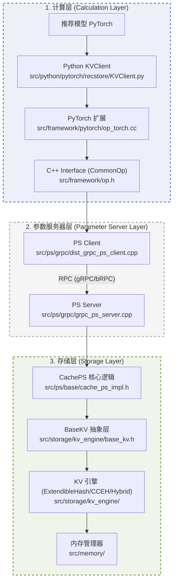

# RecStore 架构总览

RecStore 采用分层架构设计，旨在支撑万亿级稀疏参数的存储与高效更新。整个系统从逻辑上分为三层：**计算层 (Calculation Layer)**、**参数服务器层 (Parameter Server Layer)** 和 **存储层 (Storage Layer)**。

## 架构简图



---

## 1. 计算层 (Calculation Layer)

计算层是 RecStore 与深度学习框架（如 PyTorch）的交界面，负责将模型的前向查询和反向更新请求转换为 RecStore 内部的 Tensor 操作。

- **Python Client**: 提供面向用户的 [RecStoreClient](src/python/pytorch/recstore/KVClient.py) 接口。
- **PyTorch Binding**: 在 [op_torch.cc](src/framework/pytorch/op_torch.cc) 中定义了 `torch.ops.recstore_ops` 扩展。
- **C++ Interface**: [CommonOp](src/framework/op.h) 是客户端的核心抽象，`KVClientOp` 实现了跨组件的调用转发。

---

## 2. 参数服务器层 (Parameter Server Layer)

参数服务器层负责分布式环境下参数的分发与通信。它屏蔽了底层的网络细节，支持多种通信协议。

- **RPC 通信**: 支持 gRPC 和 bRPC。例如 [DistGRPCPSClient](src/ps/grpc/dist_grpc_ps_client.cpp) 负责序列化数据并发送请求。
- **服务端分发**: [GRPCPS_Server](src/ps/grpc/grpc_ps_server.cpp) 接收请求并将其路由给后端的存储逻辑。
- **协议定义**: [ps.proto](src/ps/proto/ps.proto) 定义了 `GetParameter`、`UpdateParameter` 等核心接口。

---

## 3. 存储层 (Storage Layer)

存储层是 RecStore 的核心，负责参数在异构存储介质（DRAM, NVM, SSD）上的高效读写与管理。

- **核心逻辑 (CachePS)**: [CachePS](src/ps/base/cache_ps_impl.h) 是存储层的入口，负责处理来自 RPC Server 的请求。
- **引擎抽象 (BaseKV)**: [BaseKV](src/storage/kv_engine/base_kv.h) 定义了统一的操作接口。
- **组合引擎**: [KVEngineComposite](src/storage/kv_engine/engine_composite.h) 通过 `index.type` + `value.type` 组合 DRAM 索引与 DRAM/SSD/Tiered 值存储。
- **内存管理**: 提供 [PersistSimpleMalloc](src/memory/persist_simple_malloc.h) 等组件，实现对持久化内存的直接管理。

---

???+ tip "开发参考：添加算子流转"

    可以参考 [添加算子](../dev/feature/add_operator.md) 文档来追踪一个新功能是如何从 Python 层一步步渗透到存储层的。

    ```cpp
    virtual void EmbRead(const RecTensor& keys, RecTensor& values) = 0;
    virtual void EmbUpdate(const std::string& table_name, const RecTensor& keys, const RecTensor& grads) = 0;
    ```
