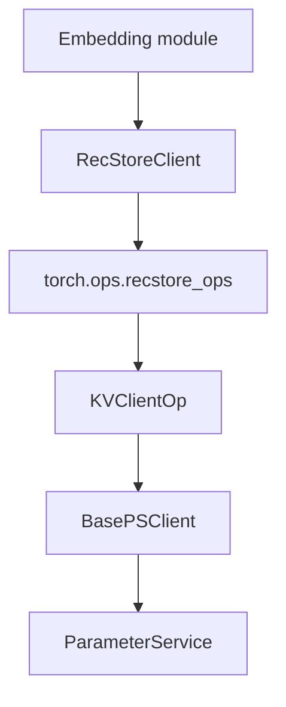

# RecStore 计算层

计算层把模型里的 sparse id 读写转换成参数服务器请求。

## 入口文件

| 层 | 文件 |
|----|------|
| TorchRec 风格模块 | `src/python/pytorch/torchrec_kv/EmbeddingBag.py` |
| 单表模块 | `src/python/pytorch/recstore/DistEmb.py` |
| Python client | `src/python/pytorch/recstore/KVClient.py` |
| PyTorch op | `src/framework/pytorch/op_torch.cc` |
| C++ facade | `src/framework/op.h`、`src/framework/op.cc` |
| Python sparse optimizer | `src/python/pytorch/recstore/optimizer.py` |
| 后端 optimizer | `src/optimizer/optimizer.cpp` |

## 数据路径

### 前向读取

| 顺序 | 操作 | 文件 |
|------|------|------|
| 1 | 模型传入 sparse feature ids。 | 用户模型 |
| 2 | Embedding 模块按表名取 ids，必要时生成 fused id。 | `torchrec_kv/EmbeddingBag.py` |
| 3 | `RecStoreClient.pull` 或 `local_lookup_flat` 调 PyTorch op。 | `recstore/KVClient.py` |
| 4 | `KVClientOp::EmbRead` 从 PS 拉取 embedding。 | `src/framework/op.cc` |
| 5 | Python 侧执行 `embedding_bag` pooling。 | `torchrec_kv/EmbeddingBag.py` |

### 梯度更新

| 顺序 | 操作 | 文件 |
|------|------|------|
| 1 | autograd backward 把 `(table, ids, grads)` 写入模块 `_trace`。 | `torchrec_kv/EmbeddingBag.py`、`recstore/DistEmb.py` |
| 2 | `SparseOptimizer.step()` 消费 `_trace`。 | `recstore/optimizer.py` |
| 3 | Python client 调 `emb_update_table` 或 local update。 | `recstore/KVClient.py` |
| 4 | PS 后端读取当前 embedding，执行 optimizer 更新，写回存储层。 | `src/optimizer/optimizer.cpp` |

### 预取

| 顺序 | 操作 | 文件 |
|------|------|------|
| 1 | `issue_fused_prefetch(features)` 去重 fused ids。 | `torchrec_kv/EmbeddingBag.py` |
| 2 | `RecStoreClient.prefetch(ids)` 返回 handle。 | `recstore/KVClient.py` |
| 3 | forward 等待 handle，取回结果。 | `torchrec_kv/EmbeddingBag.py` |
| 4 | inverse index 恢复原始顺序。 | `torchrec_kv/EmbeddingBag.py` |

Python 侧只收集和发送 sparse gradients。参数更新逻辑在后端。

## 相关页面

| 任务 | 文档 |
|------|------|
| 查 C++ / Python / `torch.ops` 接口 | [interfaces.md](./interfaces.md) |
| 接模型、改 EmbeddingBag、改 optimizer | [embedding_optimizer.md](./embedding_optimizer.md) |
