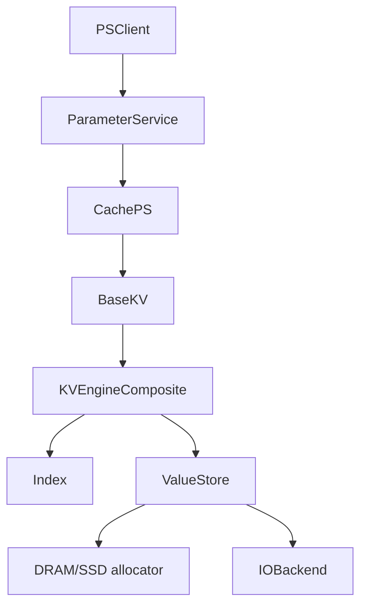

# RecStore 存储层

存储层通过本地 KV 实现参数服务器中的请求：`uint64_t key -> embedding bytes`。

主要由 `KVEngineComposite` 实现：索引仅记录 key 到 value handle 的映射，value store 保存实际字节；当 value 存储在 SSD 上时，`IOBackend` 负责页级读写。

## 代码入口

| 目的 | 文件 |
|------|------|
| 上层创建 KV | `src/ps/base/cache_ps_impl.h` |
| KV 抽象接口 | `src/storage/kv_engine/base_kv.h` |
| 配置解析 | `src/storage/kv_engine/engine_selector.h` |
| composite KV | `src/storage/kv_engine/engine_composite.h` |
| 索引接口 | `src/storage/index/index.h` |
| value store 接口 | `src/storage/value_store/value_store.h` |
| SSD IO 接口 | `src/storage/io_backend/io_backend.h` |

配置说明见 [basekv.md](./basekv.md)，组合和扩展点见 [kv_engines.md](./kv_engines.md)。

## 运行时分层

`CachePS` 从 `cache_ps.base_kv_config` 构造 `BaseKVConfig`，调用 `base::ResolveEngine`，用工厂创建 `BaseKV`。嵌套配置解析成 `KVEngineComposite`。外部引擎可用 `engine_type` 显式选择，见 [basekv.md](./basekv.md)。

## 读写路径

写入：

1. `CachePS::PutSingleParameter` 或 `PutDenseParameterBatch` 收到 key 和 float 数据。
2. 上层调用 `BaseKV::Put` 或 `BaseKV::BatchPut`。
3. `KVEngineComposite` 查 `Index`，判断 key 是否已有 handle。
4. 旧 slot 容量足够时原地覆盖；否则在 `ValueStore` 重新分配、写入，更新 `Index`。
5. 旧 handle 在索引更新后释放。

读取：

1. 上层调用 `BaseKV::Get` 或 `BaseKV::BatchGet`。
2. `KVEngineComposite` 从 `Index` 找到 value handle。
3. `ValueStore::DirectPtr` 可用时直接返回内存视图；SSD 或 tiered 的 SSD 部分调用 `Read` / `BatchRead`。
4. 未命中的 key 返回空值。

`KVEngineComposite` 用 4096 个 key stripe lock 保护读写。批量写入按 key 去重；同一批次存在重复 key 时退回逐条写入，避免覆盖顺序不清。

## 开发入口

=== "新增 Index"

    实现 `Index`，注册到 `Factory<Index, const BaseKVConfig&>`，把新 `index.type` 加入 `ResolveEngine` 的合法集合。

=== "新增 ValueStore"

    实现 `ValueStore`，注册工厂，在 `ResolveEngine` 中写清楚必填字段和非法组合。索引语义应留在 `Index`。

=== "新增 IOBackend"

    实现 `IOBackend`，注册工厂，确认 `AllocateBuffer` 返回页对齐缓冲。value store 和 SSD index 将嵌套配置转换成 `file_path`、`queue_cnt`、`page_id_offset` 后创建后端。
