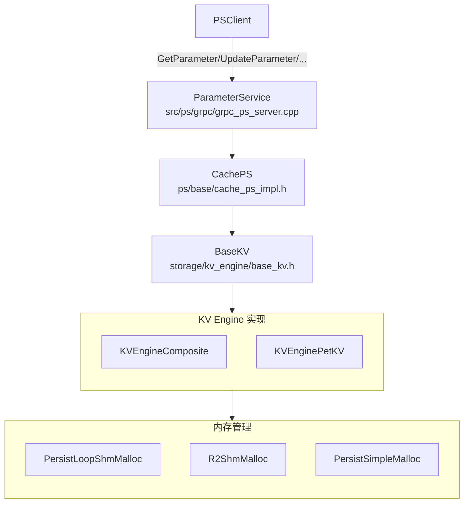

# RecStore 存储层

## 概述

存储层负责参数和嵌入向量的持久化存储与检索，从参数服务器的 CachePS 层向下，经过 BaseKV 抽象层，到具体的 KV 引擎实现，最终对接到内存管理器。

## 架构分层

## 模块说明

详细文档：

- [cacheps.md](./cacheps.md) - CachePS 层
- [basekv.md](./basekv.md) - BaseKV 抽象接口
- [kv_engines.md](./kv_engines.md) - KV 引擎实现
- [memory.md](./memory.md) - 内存管理层

## 数据流

### 写入流程

| 步骤 | 操作 | 说明 |
|------|------|------|
| 1 | GRPCPSClient.PutParameter(keys, values) | 前端/训练端批量提交键和值 |
| 2 | CachePS.PutParameter(reader, tid) | 解压参数、准备批量写入请求 |
| 3 | BaseKV.BatchPut(keys, values, tid) | 统一封装 KV 接口，分发到具体引擎 |
| 4 | KVEngine.Put(key, value_view, tid) | 按引擎策略写入 (内存/SSD/Tiered/NVM) |
| 5 | MallocApi.New(size) → 分配内存地址 | 内存管理器分配持久化地址，返回指针/偏移 |
| 6 | 写入数据到分配的内存 | 值落盘/落 PMEM，完成一次写入 |

### 读取流程

| 步骤 | 操作 | 说明 |
|------|------|------|
| 1 | GRPCPSClient.GetParameter(keys) | 前端/训练端批量读取键 |
| 2 | CachePS.GetParameter(keys, output) | 组织批量读取请求，准备输出缓冲 |
| 3 | BaseKV.BatchGet(keys, values, tid) | 统一调度到 KV 引擎 |
| 4 | KVEngine.Get(key, value, tid) | 根据索引定位值位置，读取原始字节串 |
| 5 | 从索引查找值的内存地址 | 解析指针/偏移，触发内存或存储读取 |
| 6 | 读取数据到输出缓冲区 | 转换为 ParameterPack，返回给上层 |

## 引擎选择

根据 (index_type, value_type) 组合自动选择引擎：

| index.type | value.type | 引擎 |
|------------|------------|------|
| DRAM_* | DRAM_VALUE_STORE / SSD_VALUE_STORE / TIERED_VALUE_STORE | KVEngineComposite |
